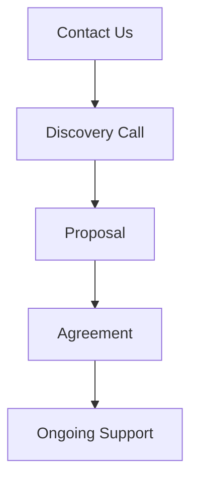

## Overview

Haus auf Sand provides operational management and sparring services to executives, teams, and organizations. You gain stability and business continuity during challenging situations. Review these answers to understand our engagement process, timelines, pricing, and results.

<Callout kind="info">
  All engagements start with a free initial consultation to assess your needs.
</Callout>

## Engagement Process

Follow these steps to begin working with Haus auf Sand.

<Steps>
  <Step title="Initial Contact" icon="phone">
    Reach out via email or phone. Share your challenges and goals.
  </Step>
  <Step title="Discovery Call" icon="video">
    Schedule a 60-minute call. We discuss your situation in detail.
  </Step>
  <Step title="Proposal" icon="file-text">
    Receive a customized proposal within 48 hours.
  </Step>
  <Step title="Kickoff" icon="rocket">
    Sign the agreement and start implementation.
  </Step>
</Steps>

## Typical Timelines

Timelines vary by engagement scope. Use this table as a guide.

| Engagement Type | Discovery | Implementation | Review |
|-----------------|-----------|----------------|--------|
| Executive Sparring | 1 week | 4-8 weeks | 2 weeks |
| Team Workshop | 2 weeks | 2-4 weeks | 1 week |
| Full Organization | 4 weeks | 3-6 months | 4 weeks |

## Pricing and Customization

Pricing depends on scope, duration, and customization. Explore options below.

<Tabs>
  <Tab title="Standard Packages" icon="package">
    Fixed-price options for common needs.
    
    | Package | Duration | Price (EUR) | Includes |
    |---------|----------|-------------|----------|
    | Sparring Basic | 4 weeks | 5,000 | 8 sessions, reports |
    | Team Support | 8 weeks | 12,000 | Workshops, coaching |
    | Full Audit | 12 weeks | 25,000 | Analysis, roadmap |
  </Tab>
  <Tab title="Custom Engagements" icon="settings">
    Tailored to your organization. Starts at 3,000 EUR/month.
    
    Contact us to discuss bespoke solutions.
  </Tab>
</Tabs>

<Callout kind="tip">
  Request a personalized quote by emailing `info@hausaufsand.de`.
</Callout>

<ExpandableGroup>
  <Expandable title="How do you customize pricing?">
    We assess your team size, challenges, and goals during discovery. You receive options ranging from hourly rates (`150 EUR/hour`) to project-based fees.
  </Expandable>
</ExpandableGroup>

## Expected Results and Case Examples

Expect measurable improvements in stability and performance. View anonymized examples.

<Columns cols={3}>
  <Card title="Tech Startup" icon="zap" horizontal>
    Reduced team turnover by 40%. Implemented clear decision processes.
  </Card>
  <Card title="Manufacturing Firm" icon="shield">
    Restored operations post-crisis. Achieved 95% continuity.
  </Card>
  <Card title="Consulting Agency" icon="users">
    Aligned leadership. Increased project delivery by 30%.
  </Card>
</Columns>

<ExpandableGroup>
  <Expandable title="What metrics do you track?">
    Key indicators include employee satisfaction, decision speed, and business continuity scores. You receive quarterly reports.
  </Expandable>
  <Expandable title="How long do results last?">
    Sustainable changes with your implementation. Many clients report ongoing benefits after 12 months.
  </Expandable>
</ExpandableGroup>