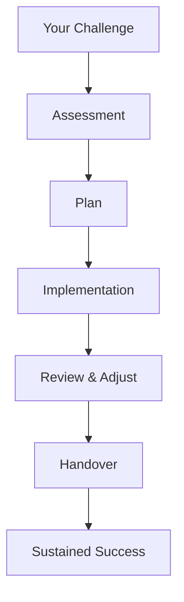

## Overview

Haus auf Sand provides targeted operative management and sparring services to help you stabilize your business, strengthen leadership teams, and ensure long-term continuity. You gain access to experienced advisors who step in during critical phases, offering hands-on support to navigate challenges like restructuring, growth pains, or sudden crises. Our approach combines strategic insight with practical execution, tailored to your unique situation.

## Core Services

We offer four interconnected services designed to address your immediate needs while building sustainable operations.

<Columns cols={2}>
  <Card title="Operative Management" icon="settings" href="/services/management">
    You receive day-to-day operational leadership to optimize processes, manage teams, and drive efficiency. We handle interim roles, implement workflows, and monitor key metrics.
  </Card>
  <Card title="Executive Sparring" icon="zap" href="/services/sparring">
    Gain a neutral sounding board for tough decisions. We challenge assumptions, refine strategies, and accelerate your progress through confidential sessions.
  </Card>
  <Card title="Team Sparring" icon="users" href="/services/team">
    Strengthen team dynamics with facilitated workshops and coaching. Resolve conflicts, align goals, and boost collaboration under pressure.
  </Card>
  <Card title="Business Continuity Planning" icon="shield" href="/services/continuity">
    Develop robust plans to safeguard operations. We assess risks, create contingency strategies, and ensure seamless transitions during disruptions.
  </Card>
</Columns>

<Callout kind="tip">
  All services are customizable. Contact us to discuss how we adapt them to your company's size, industry, and challenges.
</Callout>

## Engagement Process

Follow these steps to get started with Haus auf Sand. We prioritize quick impact while establishing a foundation for lasting success.

<Steps>
  <Step title="Initial Assessment" icon="search">
    Schedule a free consultation. We review your current challenges, team structure, and goals to identify priority areas.
  </Step>
  <Step title="Custom Plan Development" icon="file-text">
    Co-create a tailored roadmap with clear milestones, timelines, and success metrics.
  </Step>
  <Step title="Hands-On Implementation" icon="play">
    Deploy our experts on-site or remotely. Monitor progress weekly and adjust as needed.
  </Step>
  <Step title="Transition and Handover" icon="check-circle">
    Empower your team with knowledge transfer. Ensure self-sufficiency for sustained results.
  </Step>
</Steps>

## Support Tailored to Your Role

Choose the focus that matches your needs. Each option delivers specialized guidance.

<Tabs>
  <Tab title="For Executives" icon="user">
    As a CEO or managing director, you face high-stakes decisions alone. Our sparring provides objective advice on strategy, stakeholder management, and crisis navigation.
    
    <Expandable title="Real-World Example">
      A tech startup CEO used our services during a funding crunch. We helped pivot operations, secure bridge financing, and retain key talent within 60 days.
    </Expandable>
  </Tab>
  <Tab title="For Teams" icon="users">
    Teams under stress lose productivity. We facilitate alignment sessions, skill-building workshops, and performance frameworks to restore momentum.
  </Tab>
  <Tab title="For Organizations" icon="building">
    Scale sustainably with our end-to-end support. From process audits to continuity frameworks, we ensure organizational resilience.
  </Tab>
</Tabs>

## Our Delivery Process

Visualize how we ensure seamless support from start to finish.

<Callout kind="success">
  Over 90% of clients report improved stability within the first quarter. You benefit from our proven methodology refined across industries.
</Callout>

## Why Choose Haus auf Sand

You select us for our blend of empathy and expertise. We act as your extended leadership team, delivering measurable outcomes like reduced turnover, faster decision-making, and uninterrupted operations. Whether facing a leadership gap, team discord, or market shifts, our services position you for growth.

<ExpandableGroup>
  <Expandable title="Common Challenges We Solve" default-open="true">
    - Sudden executive departures
    - Restructuring under time pressure
    - Team burnout and misalignment
    - External shocks like supply chain disruptions
  </Expandable>
  <Expandable title="Next Steps">
    Book a call today. We respond within 24 hours to discuss your situation confidentially.
  </Expandable>
</ExpandableGroup>